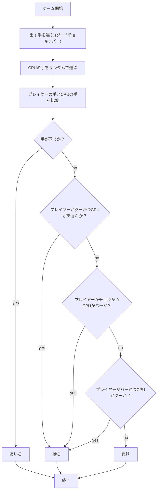
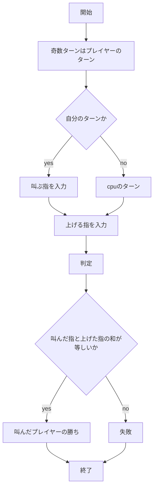
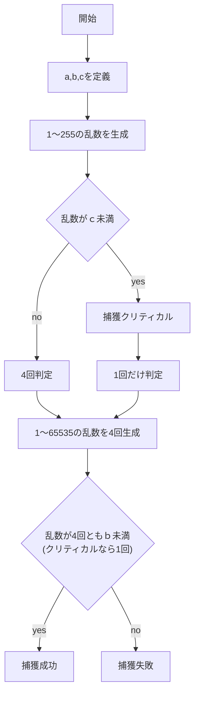
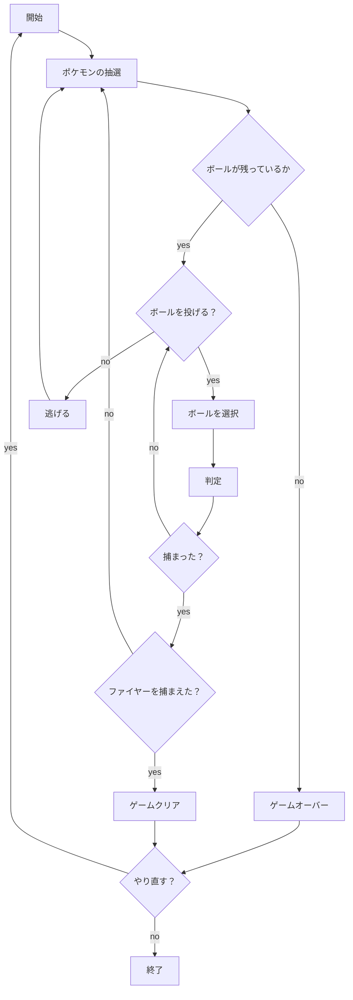
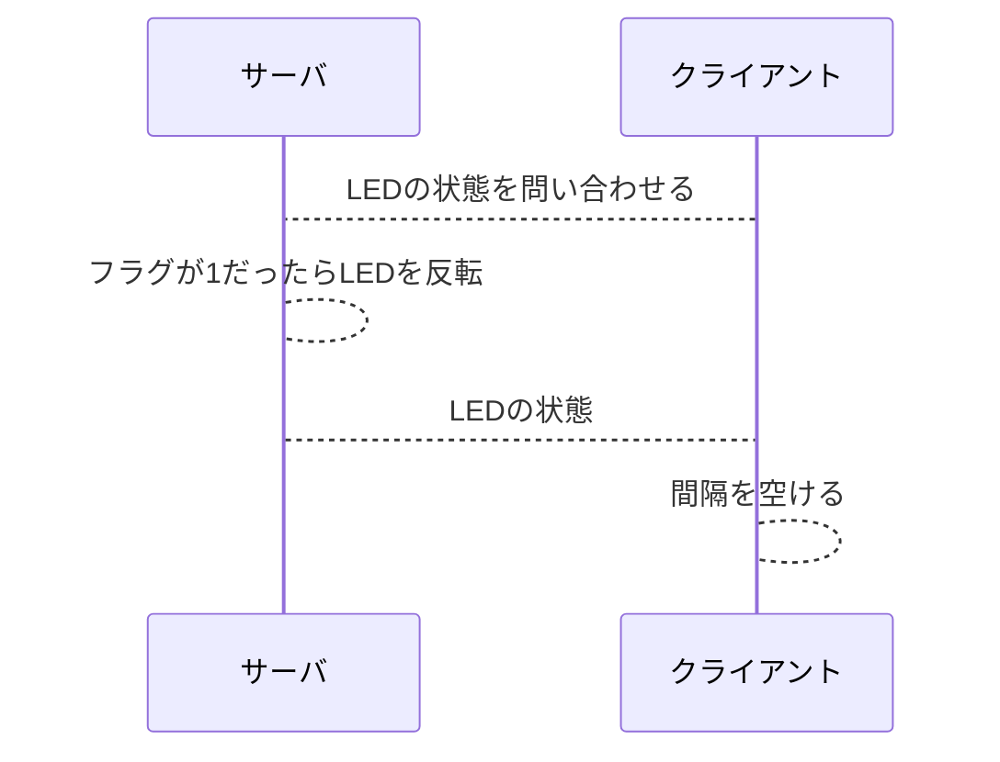

# webpro_06
2024, 11/15

## app5.js
### hello1について
1. app5.jsを起動する
1. webブラウザでlocalhost8080/showにアクセスする
1. メッセージを変数として，ejsに送る
1. 画面に"hello world"と"Bon jour"が表示される．
### hello2について
hello1とほぼ同じ機能である．異なる点としては，hello1は変数にメッセージ内容を代入してejsに送るが，hello2はメッセージを直接ejsに送る．メッセージを直接送ることで記述するコードは短くなっているが，内容を変更するときに表示箇所をすべて変更する必要があるのがデメリットである．
### iconについて
1. app5.jsを起動する
1. webブラウザでlocalhost8080/iconにアクセスする
1. アイコンが表示される．(今回はappleロゴ)

### luckについて
1. app5.jsを起動する
1. webブラウザでlocalhost8080/luckにアクセスする
1. 2つの乱数が生成され，「大吉」「中吉」のどちらかが表示される

### jankenについて
1. app5.jsを起動する
1. webブラウザでlocalhost8080/jankenにアクセスする
1. 出す手を選択 (グー，チョキ，パー)
1. cpuの出す手と勝負をし，勝数と試合数が表示される．

## いっせーのっせゲームについて
1. app5.jsを起動する
1. webブラウザでlocalhost8080/figにアクセスする
1. 「スタート」を選択する
1. (相手のターン)上げる指を入力(0〜2)
1. (自分のターン)叫ぶ指(0〜4)と上げる指を入力
1. 叫んだ指とお互いの上げた指の和が等しいとき，叫んだプレイヤーの勝ち


## ポケモンゲットゲームについて
1. app5.jsを起動する
1. webブラウザでlocalhost8080/pokemonにアクセスする
1. 「スタート」を選択する
1. ランダムでポケモンが現れるので，使うボールを選択する．(モンスターボール，スーパーボール，ハイパーボール)
1. 捕獲の判定が行われ，成功すると捕まえたポケモンの数が増える．
1. 複数のポケモンを捕まえると「捕獲クリティカル」の確率が高まる．
1. ボールを使い切ってしまうとゲームオーバー
1. すべてのボールを使い切る前に伝説のポケモン「ファイヤー」を捕まえよう！

出現するポケモン | 特徴
-|-
ピカチュウ | 最も捕まえやすいポケモン
モココ | やや捕まえやすいポケモン
ニョロトノ | やや捕まえにくいポケモン．ボールを20回投げると出現するようになる．5匹以上捕まえたとき上昇するクリティカル補正が大きい
ダンバル | 捕まえにくいポケモン．ボールを20回投げると出現するようになる．5匹以上捕まえたとき上昇するクリティカル補正がとても大きい
ファイヤー | ボールを50回投げると出現するようになる．このポケモンを捕まえるとゲームクリア
### app.pokemon(一部抜粋)
プログラム本体である．乱数を生成し，ejs側に表示する画面の情報を渡す．下ソースコード内のswitch文はフォームから送られてきた数値を読み取り，次に行う処理の管理を行っている．
```javascript

app.get("/pokemon", (req, res) => {
  const ball = req.query.ball;
  let count = [
    Number(req.query.count_pika) || 0,  //配列の中身がNaNになることを防ぐ
    Number(req.query.count_moko) || 0,
    Number(req.query.count_nyor) || 0,
    Number(req.query.count_danb) || 0,
    Number(req.query.count_fire) || 0
  ];
  
  let k = 4; t = 1;
  let a = 0; b = 0; c = 0; d = 0;
  let critical = '';
  const cri = Math.floor( Math.random() * 255 + 1 );  //1〜255の乱数を生成
  let num = new Array(4);
  for(let v = 0; v < 4; v++)
    num[v] = Math.floor( Math.random() * 65535 + 1 ); //1〜65535の乱数を4列の配列に格納
  
  switch(Number(ball)){
    case 1: t = 1; --left[0]; actionType = 3; break;    //モンスターボールを使用する
    case 2: t = 1.5; --left[1]; actionType = 3; break;    //スーパーボールを使用する
    case 3: t = 2; --left[2]; actionType = 3; break;    //ハイパーボールを使用する
    case 4: actionType = 4; inc = 1; break;   //「逃げる」を選択し，ポケモンを再抽選
    case 5: actionType = 2; break;    //捕獲判定に移る
    case 6: {
      actionType = 1; 
      count = [0, 0, 0, 0, 0];      //捕獲したポケモンの数，ボールの数，捕獲クリティカルの閾値を初期化
      left = [50, 30, 20]; 
      cri_point = 0; 
      all_inc = 0; 
      cri_judge = [5, 5, 5, 5]; 
      break;
    }
  }

```
### choose
ポケモンの抽選を行う関数．乱数の生成とともに投げたボールの数から出現させるポケモンを制限する．ボールを投げた回数が指定の数値に届かなかった場合はこの関数を再帰的に呼び出して再び抽選を行う．
```
function encount(corr, left){
  choose = Math.floor( Math.random() * 5 + 1 ); //1〜5の乱数をつくる
  if(choose == 1){  //捕捉率と最大HPを配列に代入する
    mon = 'ピカチュウ'; corr[0] = 255; corr[1] = 20; return choose;
  }
  else if(choose == 2){
    mon = 'モココ'; corr[0] = 190; corr[1] = 26; return choose;
  }
  else if(choose == 3 && (50 - left[0] + 30 - left[1] + 20 - left[2]) >= 30){   
    mon = 'ニョロトノ'; corr[0] = 120; corr[1] = 41; return choose;
  }   //ニョロトノとダンバルはボールを30回投げると現れるようになる
  else if(choose == 4 && (50 - left[0] + 30 - left[1] + 20 - left[2]) >= 30){
    mon = 'ダンバル'; corr[0] = 45; corr[1] = 52; return choose;
  }   //ボールを50回投げるとファイヤーが現れるようになる
  else if(choose == 5 && (50 - left[0] + 30 - left[1] + 20 - left[2]) >= 50){
    mon = 'ファイヤー'; corr[0] = 3; corr[1] = 165; return choose;
  }
  else{
    return encount(corr, left);   //再帰的関数にする
  }
}
```
## pokemon.ejs(一部抜粋)
プレイヤーインターフェイスとなる箇所．スタート画面，ボールの選択画面，捕獲判定画面，逃げる画面，ゲームクリア画面をapp5.jsから受け取ったactionTypeの値から判断して表示させる．ボールの選択画面では残り0個になってしまったボールは選択肢から除外し，すべて0の場合ゲームオーバーとなる．
捕まえたポケモンの数はここで全て保存されており，フォームを送信するたびに配列が初期化されることを防いでいる．
```
<% if (actionType == 1) { %>    //actionTypeが1のとき，スタート画面を表示
        <h1>ポケモンゲットゲーム</h1>
        <p>ランダムで現れるポケモンを捕まえよう！</p>
        <hr>
        <form action="/pokemon" method="get">
            <input type="radio" name="ball" id="ball5" value="5">
            <label for="ball5">スタート！</label><br>
            <input type="submit" value="送信">

            //countの中身がNaNにならないよう条件を追加
            <input type="hidden" name="count_pika" value="<%= (count_pika) ? count_pika : 0 %>">
            <input type="hidden" name="count_moko" value="<%= (count_moko) ? count_moko : 0 %>">
            <input type="hidden" name="count_nyor" value="<%= (count_nyor) ? count_nyor : 0 %>">
            <input type="hidden" name="count_danb" value="<%= (count_danb) ? count_danb : 0 %>">
            <input type="hidden" name="count_fire" value="<%= (count_fire) ? count_fire : 0 %>">
        </form>
```
## 捕獲判定
今回参考にした捕獲判定はポケモン3〜5世代で使用されていた計算方法である．都合上，原作とは異なる計算式となっている．

まず判定に使用する変数を定義
1. a = (最大HP×4096×捕捉率×ボール補正)÷(最大HP×3)
1. b = 65535÷√√(1044480÷a)
1. c = (b×クリティカル補正)÷(4096)


### 各種数値
捕捉率はポケモンごとに設定された捕まえやすさの指数である．捕捉率が大きいほど捕まえやすく，最大HPが高いほど捕まえにくい
ポケモン名 | 捕捉率 | 最大HP 
-|-|-
ピカチュウ | 255 | 20
モココ | 190 | 26
ニョロトノ | 120 | 40
ダンバル | 45 | 52
ファイヤー | 3 | 165

ボールごとに捕まえやすさが異なる．補正率が大きいほど捕まえやすいボールである
ボール名 | ボール補正 | 所持数
-|-|-
モンスターボール | 1 | 50
スーパーボール | 1.5 | 30
ハイパーボール | 2 | 20

ポケモンを捕まえた数に応じてクリティカル補正が上昇し捕獲クリティカルが起こりやすくなる．図鑑完成度と倒した数によってクリティカル率が上昇する原作ゲームを踏襲した．
条件 | クリティカル補正
-|-
初期値 | 0
ファイヤー以外を全て捕まえる(一度きり) | ＋1.5
ピカチュウまたはモココを5匹捕まえるごとに上昇 | ＋1.5
ニョロトノを5匹捕まえるごとに上昇 | ＋2.5
ダンバルを5匹捕まえるごとに上昇 | ＋3


### 全体の流れ


