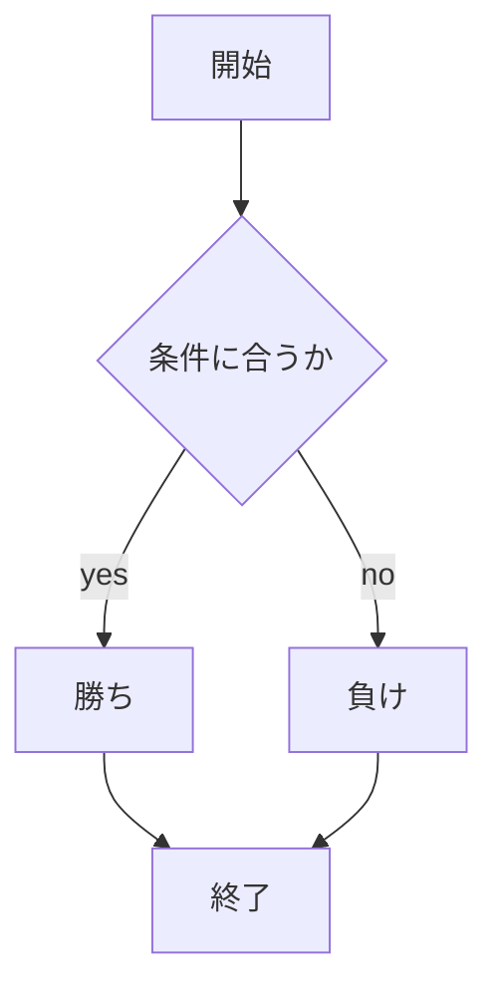

# webpro_06
2024, 10/29
## このプログラムについて
1. app5.jsを起動する
1. webブラウザでlocalhost8080/public/janken.htmlにアクセスする
1. じゃんけんする
```javascript
  if( num==1 ) cpu = 'グー';
  else if( num==2 ) cpu = 'チョキ';
  else cpu = 'パー';
  // ここに勝敗の判定を入れる
  if(hand == cpu){
    judgement = 'あいこ';
    total += 1;
  }
  else if((hand == 'グー' && num == 2) || (hand == 'チョキ' && num == 3) || (hand == 'パー' && num == 1)){
    judgement = '勝ち';
    win += 1;
    total += 1;
  }
  else{
    judgement = '負け';
    total += 1;
  }
```



## ファイル一覧
ファイル名 | 説明
-|-
app5.js | プログラム本体
janken.ejs | テンプレートファイル
public/janken.html | じゃんけん画面